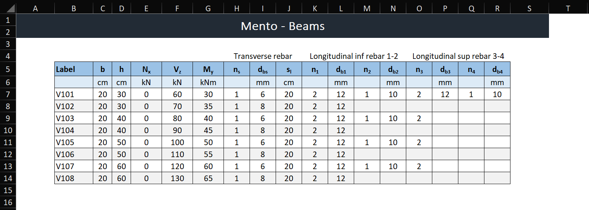

Beam Summary
==========

The `BeamSummary` let you work with a list of `Sections` and perform several calculations at the same time.

Creating Concrete and Steel Materials
-------------------------------------

The first step is to define the concrete and steel materials that will be used in your beam design:

.. code-block:: python

    conc = Concrete_ACI_318_19(name="C25", f_c=25*MPa)
    steel = SteelBar(name="ADN 420", f_y=420*MPa)

These materials are required for all beam designs.

Loading Input Data from Excel
-----------------------------

The beam dimensions, forces, and reinforcement details are typically loaded from an Excel input file. The file should have a specific format and units, as shown below:

The recommended way to read the excel file is with Pandas.

.. code-block:: python

    input_df = pd.read_excel('Mento-Input.xlsx', sheet_name='Beams', usecols='B:R', skiprows=4)

The Excel file should contain the following columns:

- **Label**: Beam identifier (e.g., V101, V102).
- **b**: Beam width in cm.
- **h**: Beam height in cm.
- **Nx**: Axial force in kN.
- **Vz**: Shear force in kN.
- **My**: Moment in kNm.
- **ns**: Number of shear reinforcement bars.
- **dbs**: Diameter of shear reinforcement bars in mm.
- **sl**: Spacing of shear reinforcement bars in cm.
- **n1, n2, n3, n4**: Number of longitudinal reinforcement bars in each layer.
- **db1, db2, db3, db4**: Diameter of longitudinal reinforcement bars in mm.

Consider that bottom reinforcement will be checked against positive bending moments and top reinforcement against negative bending moments.

Creating the BeamSummary Object
-------------------------------

Once the input data is loaded, you can create a `BeamSummary` object:

.. code-block:: python

    beam_summary = BeamSummary(concrete=conc, steel_bar=steel, beam_list=input_df)

To verify that the data was imported correctly, you can inspect the `data` attribute:

.. code-block:: python

    beam_summary.data

Checking Beam Capacity
----------------------

The `BeamSummary` class allows you to check the capacity of the beam sections. There are two ways to perform this check:

1. **Capacity Check Without Forces**: This checks the capacity of the sections based on the provided reinforcement details only.

.. code-block:: python

    beam_summary.check(capacity_check=True)

2. **Capacity Check With Forces**: This checks the capacity of the sections for the forces specified in the input data.

.. code-block:: python

    beam_summary.check()

Exporting Results
-----------------

To export the results of the capacity check to an Excel file, use the following code:

.. code-block:: python

    beam_summary.check().to_excel('results.xlsx', index=False)

Viewing Detailed Results
------------------------

For a detailed breakdown of the results, you can use the `shear_results` or `flexure_results` method. 
Thess methods provide a DataFrame with detailed results for each beam:

- **Without Capacity Check**:

.. code-block:: python

    beam_summary.shear_results(capacity_check=False)
    beam_summary.flexure_results(capacity_check=False)

- **With Capacity Check**:

.. code-block:: python

    beam_summary.shear_results(capacity_check=True)
    beam_summary.flexure_results(capacity_check=True)

