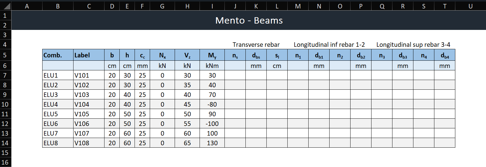

Beam Summary
============

The ``BeamSummary`` class lets you work with a list of beam sections and perform
checks, design, and report generation for all of them at once.

Creating Concrete and Steel Materials
--------------------------------------

Define the concrete and steel materials to be used across all beams:

.. code-block:: python

    from mento.material import Concrete_ACI_318_19, Concrete_EN_1992_2004, SteelBar
    from mento import MPa

    # ACI 318-19
    conc = Concrete_ACI_318_19(name="C25", f_c=25 * MPa)

    # or EN 1992-2004
    conc = Concrete_EN_1992_2004(name="C25/30", f_c=25 * MPa)

    steel = SteelBar(name="ADN 420", f_y=420 * MPa)

Supported design codes: **ACI 318-19**, **EN 1992-2004**, and **CIRSOC 201-25**.

Loading Input Data from Excel
------------------------------

The beam dimensions, forces, and reinforcement details are typically loaded from
an Excel input file. The file should have a specific format and units, as shown below:

The recommended way to read the Excel file is with pandas:

.. code-block:: python

    import pandas as pd

    input_df = pd.read_excel('Mento-Input.xlsx', sheet_name='Beams', usecols='B:S', skiprows=4)

The Excel file should contain the following columns:

- **Label**: Beam identifier (e.g., V101, V102).
- **Comb.**: Load combination label.
- **b**: Beam width in cm.
- **h**: Beam height in cm.
- **cc**: Stirrup clear cover in mm.
- **Nx**: Axial force in kN.
- **Vz**: Shear force in kN.
- **My**: Moment in kNm.
- **ns**: Number of stirrup legs.
- **dbs**: Stirrup diameter in mm.
- **sl**: Stirrup spacing in cm.
- **n1, n2, n3, n4**: Number of longitudinal bars per group.
- **db1, db2, db3, db4**: Diameter of longitudinal bars in mm.

Bottom reinforcement is checked against positive bending moments; top reinforcement
against negative bending moments.

For a quick test you can build the DataFrame manually:

.. code-block:: python

    data = {
        "Label": ["", "V101", "V102", "V103", "V104"],
        "Comb.": ["", "ELU 1", "ELU 2", "ELU 3", "ELU 4"],
        "b": ["cm", 20, 20, 20, 20],
        "h": ["cm", 50, 50, 50, 50],
        "cc": ["mm", 25, 25, 25, 25],
        "Nx": ["kN", 0, 0, 0, 0],
        "Vz": ["kN", 20, -50, 100, 100],
        "My": ["kNm", 0, -35, 40, 45],
        "ns": ["", 0, 1.0, 1.0, 1.0],
        "dbs": ["mm", 0, 6, 6, 6],
        "sl": ["cm", 0, 20, 20, 20],
        "n1": ["", 2.0, 2, 2.0, 2.0],
        "db1": ["mm", 12, 12, 12, 12],
        "n2": ["", 1.0, 1, 1.0, 0.0],
        "db2": ["mm", 10, 16, 10, 0],
        "n3": ["", 2.0, 0.0, 2.0, 0.0],
        "db3": ["mm", 12, 0, 16, 0],
        "n4": ["", 0, 0.0, 0, 0.0],
        "db4": ["mm", 0, 0, 0, 0],
    }
    input_df = pd.DataFrame(data)

Creating the BeamSummary Object
---------------------------------

Once the input data is ready, create a ``BeamSummary`` object:

.. code-block:: python

    from mento.summary import BeamSummary

    beam_summary = BeamSummary(concrete=conc, steel_bar=steel, beam_list=input_df)

To verify that units were applied correctly, inspect the ``data`` attribute:

.. code-block:: python

    beam_summary.data

Checking Beam Capacity
-----------------------

Use ``check()`` to get a summary table with DCR (Demand-Capacity Ratio) values for
all beams. Two modes are available:

**Check with applied forces** (uses the forces in the input data):

.. code-block:: python

    beam_summary.check()

**Capacity check** (zeros all forces to report section capacity only):

.. code-block:: python

    beam_summary.check(capacity_check=True)

The result is a DataFrame with identification, reinforcement, DCR columns, and a
pass/fail status (✅ / ❌). For EN 1992-2004 concrete, code-specific capacity columns
(``MRd,top``, ``MRd,bot``, ``VRd``) are added automatically; for ACI 318-19 and
CIRSOC 201-25 the equivalent columns are ``ØMn,top``, ``ØMn,bot``, ``ØVn``.

Viewing Detailed Results
-------------------------

For a full breakdown per beam use ``flexure_results()`` and ``shear_results()``.
Both methods accept an optional ``index`` (1-based) to retrieve results for a single
beam, and a ``capacity_check`` flag:

.. code-block:: python

    # All beams — forces from input
    beam_summary.flexure_results()
    beam_summary.shear_results()

    # All beams — capacity check (adds MRd,top / MRd,bot or ØMn,top / ØMn,bot columns)
    beam_summary.flexure_results(capacity_check=True)
    beam_summary.shear_results(capacity_check=True)

    # Single beam (1-based index)
    beam_summary.flexure_results(index=2)
    beam_summary.shear_results(index=2)

For step-by-step detail of a specific beam you can also access the node directly:

.. code-block:: python

    beam_summary.nodes[2].check_shear()
    beam_summary.nodes[2].check_flexure()

Designing Reinforcement
------------------------

``design()`` runs automatic flexure and shear design for every beam and returns a
DataFrame with the filled rebar columns (``n1``–``n4``, ``db1``–``db4``, ``ns``, ``dbs``, ``sl``):

.. code-block:: python

    designed_df = beam_summary.design()

Exporting and Importing a Design
----------------------------------

After running ``design()``, save the result to Excel so it can be reviewed or edited:

.. code-block:: python

    beam_summary.export_design("BeamDesign.xlsx")

To reload an edited file and rebuild the summary with the new reinforcement:

.. code-block:: python

    beam_summary.import_design("BeamDesign.xlsx")

Exporting Results to Excel
----------------------------

The DataFrames returned by ``check()``, ``flexure_results()``, and ``shear_results()``
can be written to Excel directly:

.. code-block:: python

    beam_summary.check().to_excel("results.xlsx", index=False)

Detailed Word Report
---------------------

``results_detailed_doc()`` generates a Word document (``.docx``) that contains:

- Full flexure and shear detail for one selected beam.
- Summary tables (beam data, flexure results, shear results, DCR check) for all beams.

The document is saved to the current working directory with the name
``Beam_Summary_{design_code}.docx`` (e.g. ``Beam_Summary_ACI 318-19.docx``).

.. code-block:: python

    # Detailed report with beam 1 as the reference beam (default)
    beam_summary.results_detailed_doc()

    # Use beam 3 as the reference beam
    beam_summary.results_detailed_doc(index=3)

The ``index`` parameter is 1-based and must be within the range of beams in the
summary. An ``IndexError`` is raised for out-of-range values.
