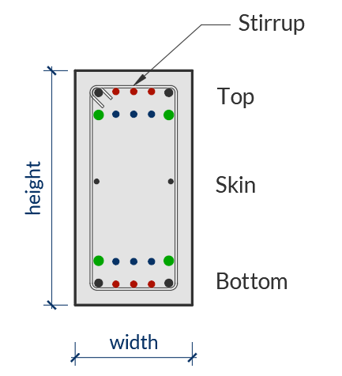
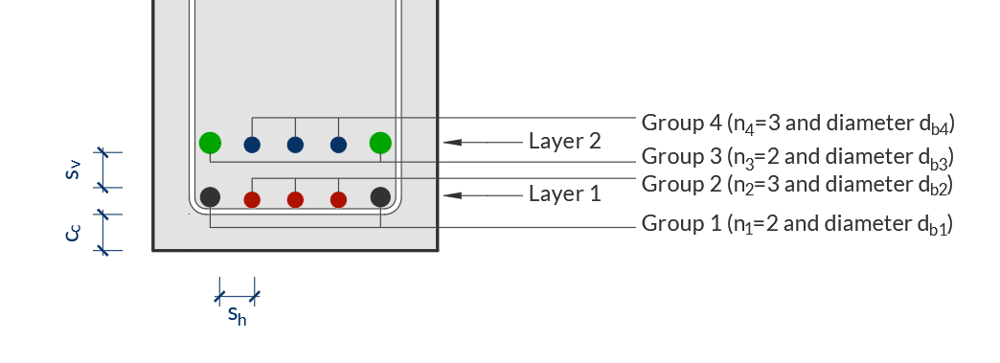

Beam
==========

The `Beam` class in the `mento` package is designed to model and analyze rectangular reinforced concrete beams.
It allows users to define the geometry, material properties, reinforcement and custom settings.

Key Concepts
------------

- **Beam Geometry**: Defined by `width` and `height`.
- **Material Properties**: Requires a `Concrete` object (e.g., `Concrete_ACI_318_19`) and a `SteelBar` object for reinforcement.
- **Reinforcement**: Longitudinal and transverse reinforcement can be defined using `set_longitudinal_rebar_bot`, `set_longitudinal_rebar_top`, and `set_transverse_rebar`.
- **Custom settings**: A `Beam` object can havce custom settings overriding the default settings of `mento.

Usage
-----

Below is a step-by-step guide on how to use the `Beam` class in your structural analysis workflows.

1. Creating a Beam Object
*************************

To define a beam, you need to specify its geometry, material properties, and clear cover.
The `RectangularBeam` class is used for this purpose. If no custom settings are passed to the *Beam* object, it will take the default values.

.. code-block:: python

    from mento import Concrete_ACI_318_19, SteelBar, RectangularBeam, mm, cm, kN, MPa

    # Define materials
    concrete = Concrete_ACI_318_19(name="C25", f_c=25*MPa)
    steel = SteelBar(name="ADN 420", f_y=420*MPa)

    # Define beam geometry
    beam = RectangularBeam(label="101", concrete=concrete, steel_bar=steel, width=20*cm, height=50*cm, c_c = 2.5*cm)

2. Setting Reinforcement
************************

You can define the longitudinal and transverse reinforcement for the beam using the following methods:

- **Bottom Longitudinal Reinforcement**: Use `set_longitudinal_rebar_bot`.
- **Top Longitudinal Reinforcement**: Use `set_longitudinal_rebar_top`.
- **Transverse Reinforcement (Stirrups)**: Use `set_transverse_rebar`.

.. note::
    Consider that:

    - If no transverse reinforcement is defined, it is assumed that plain concrete will resist shear forces.
    - If no longitudinal reinforcement is defined, a minimum of 2Ø8 will be considered for metric system or 2#3 for imperial system of units. Mento won't check a beam without longitudinal rebar.
    - Skin rebar is not considered for the check or design of the beam.

**Transverse reinforcement**
This is set indicating amount of stirrups, the diameter of the stirrups and the spacing of the legs along the beam.

**Longitudinal reinforcement**
This is set indicating rebar for two layers, differentiating between border bars and inner bars.
Each group of bars, for each layer has a unique number id. Bars can be defined both for top and bottom of the beam,
which will be considered for negative and positive bending moments respectively.

In case a flexure analysis requires compression reinforcement additional to the tension reinforcement, the opposite reinforcement will be considered.
For example, if a positive moment is so large that the section must be reinforced at top&bottom, the top rebar will also be considered in the beam capacity for flexure.

.. code-block:: python

    # Set bottom longitudinal reinforcement
    beam.set_longitudinal_rebar_bot(n1=2, d_b1=16*mm, n2=1, d_b2=12*mm)

    # Set top longitudinal reinforcement
    beam.set_longitudinal_rebar_top(n1=2, d_b1=16*mm)

    # Set transverse reinforcement (stirrups)
    beam.set_transverse_rebar(n_stirrups=1, d_b=10*mm, s_l=20*cm)

3. Assigning Forces to the Beam
*******************************

Forces are applied to the beam through a `Node` object, which joins the `Beam` and `Forces` object together.
See the `Node` section for more information on how to create a `Node` and assign forces to the section.

4. Performing Checks
********************

Once the beam is defined and forces are assigned in a `Node` object, you can perform checks for shear and flexure.
See the `Node` section for more information on how to create a Node and check the section.

5. Design the section
********************

If you don't assign transverse or longitudinal rebar, you can ask *Mento* to design for shear and flexure.
See the `Node` section for more information on how to create a Node and design the section.

6. Jupyter Notebook Results
******************

After performing the checks, you can view the results in a formatted way in a Notebook.

When you run `node.results`, the output includes:

- **Top and bottom longitudinal reinforcement**.
- **Shear reinforcement**.
- **Applied moments and shear forces**.
- **Design capacity ratios (DCR)**.
- **Warnings** (if any).

The output is formatted using LaTeX math notation for clarity and precision.

Example Output
--------------

Here’s an example of the output from `beam.results`:

.. math::

    \textsf{Beam 101}, \, b = 20.00 \, \textsf{cm}, \, h = 60.00 \, \textsf{cm}, \, c_{\text{c}} = 2.50 \, \textsf{cm}, \, \textsf{Concrete C25}, \, \textsf{Rebar ADN 420}.

    \textsf{Top longitudinal rebar: } 2\phi16, \, A_{s,\text{top}} = 4.02 \, \textsf{cm}^2, \, M_u = -80 \, \textsf{kNm}, \, \phi M_n = 81.65 \, \textsf{kNm} \rightarrow \textsf{DCR} = 0.98

    \textsf{Bottom longitudinal rebar: } 2\phi16 + 1\phi12 ++ 2\phi12 + 1\phi10, \, A_{s,\text{bot}} = 8.2 \, \textsf{cm}^2, \, M_u = 90 \, \textsf{kNm}, \, \phi M_n = 154.95 \, \textsf{kNm} \rightarrow \textsf{DCR} = 0.58

    \textsf{Shear reinforcing: } 1s\phi10/20 \, \textsf{cm}, \, A_v = 7.85 \, \textsf{cm}^2/\textsf{m}, \, V_u = 80 \, \textsf{kN}, \, \phi V_n = 196.24 \, \textsf{kN} \rightarrow \textsf{DCR} = 0.41

Interpreting the Output
-----------------------

**Geometry and Materials**

The first line provides the beam's geometry and material properties:

- **Beam 101**: Beam identifier.
- :math:`b = 20.00 \, \textsf{cm}`: Beam width.
- :math:`h = 60.00 \, \textsf{cm}`: Beam height.
- :math:`c_{\text{c}} = 2.50 \, \textsf{cm}`: Concrete clear cover.
- **Concrete C25**: Concrete grade.
- **Rebar ADN 420**: Rebar grade.

**Longitudinal Reinforcement**

- **Top longitudinal rebar**: Reinforcement at the top of the beam.

  - :math:`2\phi16``: 2 bars of 16 mm diameter.
  - :math:`A_{s,\text{top}} = 4.02 \, \textsf{cm}^2`: Area of top reinforcement.
  - :math:`M_u = -80 \, \textsf{kNm}`: Applied moment at the top.
  - :math:`\phi M_n = 81.65 \, \textsf{kNm}`: Design moment capacity at the top.
  - :math:`\textsf{DCR} = 0.98`: Design capacity ratio :math:`\textsf{DCR} = M_u / \phi M_n`.

- **Bottom longitudinal rebar**: Reinforcement at the bottom of the beam.

  - :math:`2\phi16 + 1\phi12 ++ 2\phi12 + 1\phi10`: Combination of bars.
  - :math:`A_{s,\text{bot}} = 8.2 \, \textsf{cm}^2`: Area of bottom reinforcement.
  - :math:`M_u = 90 \, \textsf{kNm}`: Applied moment at the bottom.
  - :math:`\phi M_n = 154.95 \, \textsf{kNm}`: Design moment capacity at the bottom.
  - :math:`\textsf{DCR} = 0.58`: Design capacity ratio :math:`\textsf{DCR} = M_u / \phi M_n`.

**Shear Reinforcement**

- **Shear reinforcing**: Shear reinforcement details.

  - :math:`1s\phi10/20 \, \textsf{cm}`: 10 mm diameter stirrups spaced at 20 cm.
  - :math:`A_v = 7.85 \, \textsf{cm}^2/\textsf{m}`: Area of shear reinforcement per meter.
  - :math:`V_u = 80 \, \textsf{kN}`: Applied shear force.
  - :math:`\phi V_n = 196.24 \, \textsf{kN}`: Design shear capacity.
  - :math:`\textsf{DCR} = 0.41`: Design capacity ratio :math:`\textsf{DCR} = V_u / \phi V_n`.

- **Check DCR Values**: A DCR less than 1.0 indicates that the beam is safe under the applied loads.
- **Review Warnings**: If the output includes warnings, review the design to ensure compliance with code requirements. You can check detailed results for more information.

7. Detailed Results
*******************

See the `Node` section for more information on how to display and save detailed results of the analysis.

8. Plot section
*******************

You can use the method `plot()` to visualize the beam's cross-section and reinforcement layout.

.. code-block:: python

  # Plot the beam section
  beam.plot()

The `plot()` method generates a graphical representation of the beam, including its geometry and reinforcement details.
This can be useful for verifying the input data and for presentation purposes.
