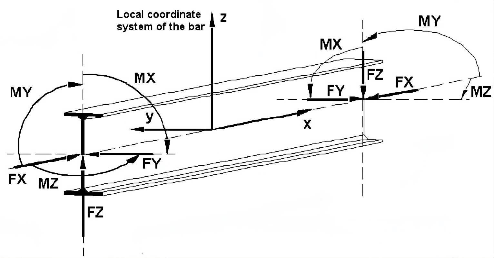
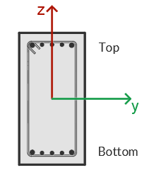

Coordinate System
===================================

The local coordinate system of a structural member is a dextrorotary Cartesian system with the following orientation of axes:

- The local **x-axis** is always the longitudinal axis of the element, defined from the **beginning node (A)** to the **end node (B)**. The origin of the system is positioned at the beginning node of the member.

- The local **y-axis** and **z-axis** lie in the plane of the member's cross-section and are arranged according to dextrorotary rotation. By default:

  - The **y-axis** represents the axis of the greater moment of inertia of the member.
  - The **z-axis** represents the axis of the lesser moment of inertia of the member.

Sectional Analysis
------------------

For sectional analysis, the local **y-axis** and **z-axis** are critical for understanding the orientation of the member's cross-section.
Below is an illustration of the cross-section with the local **y-axis** and **z-axis**:

