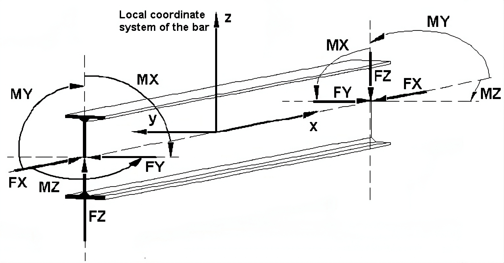
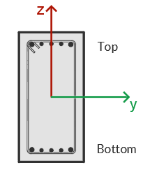

Coordinate System
===================================

The local coordinate system of a structural member is a dextrorotary Cartesian system with the following orientation of axes:

- The local **x-axis** is always the longitudinal axis of the element, defined from the **beginning node (A)** to the **end node (B)**. The origin of the system is positioned at the beginning node of the member.

- The local **y-axis** and **z-axis** lie in the plane of the member's cross-section and are arranged according to dextrorotary rotation. By default:

  - The **y-axis** represents the axis of the greater moment of inertia of the member.
  - The **z-axis** represents the axis of the lesser moment of inertia of the member.

Sectional Analysis
------------------

For sectional analysis, the local **y-axis** and **z-axis** are critical for understanding the orientation of the member's cross-section.
Below is an illustration of the cross-section with the local **y-axis** and **z-axis**:

Sign Convention
---------------

The sign of each force component is not merely descriptive — it changes the result of
a check, so it must match the convention below.

.. list-table::
   :header-rows: 1
   :widths: 15 25 60

   * - Component
     - Positive means
     - Effect on the design
   * - ``N_x``
     - **Compression**
     - Compression adds to the concrete shear strength; tension (a negative
       ``N_x``) subtracts from it.
   * - ``M_y``
     - **Sagging** (tension at the bottom fibre)
     - Selects which face is the tension face: a positive ``M_y`` designs the
       bottom reinforcement, a negative ``M_y`` the top.
   * - ``V_z``
     - **Magnitude of the design shear**
     - Shear is checked against a symmetric resistance, so its direction does not
       change the outcome. Always pass it as a positive value.

Axial force
***********

``N_x`` is **positive in compression** and negative in tension. This follows the axial
term of both implemented codes, which is added to the concrete contribution:

- ACI 318-19 §22.5.5.1 — :math:`\sigma_{Nu} = N_u / (6 A_g)`, capped at :math:`0.05 f'_c`.
- EN 1992-1-1 §6.2.2(1) — :math:`\sigma_{cp} = N_{Ed} / A_c`, capped at :math:`0.2 f_{cd}`.

A tensile axial force therefore reduces the concrete shear strength, which is the
intended behaviour. Passing a tension force as a positive number is unconservative.

Bending moment
**************

``M_y`` is **positive when it produces tension at the bottom** of the section (sagging).
The check uses the sign to pick the tension face, so a support moment must be entered as
negative for the top reinforcement to be designed.

Shear force
***********

``V_z`` is the design shear at the section under consideration. The demand-capacity ratio
is formed from its absolute value, so a sign error does not change a *check* — but the
*design* routine sizes stirrups from the largest required :math:`A_v` across the load
combinations, and a negative ``V_z`` would be read as a smaller demand. Always enter
shear as a positive magnitude.
